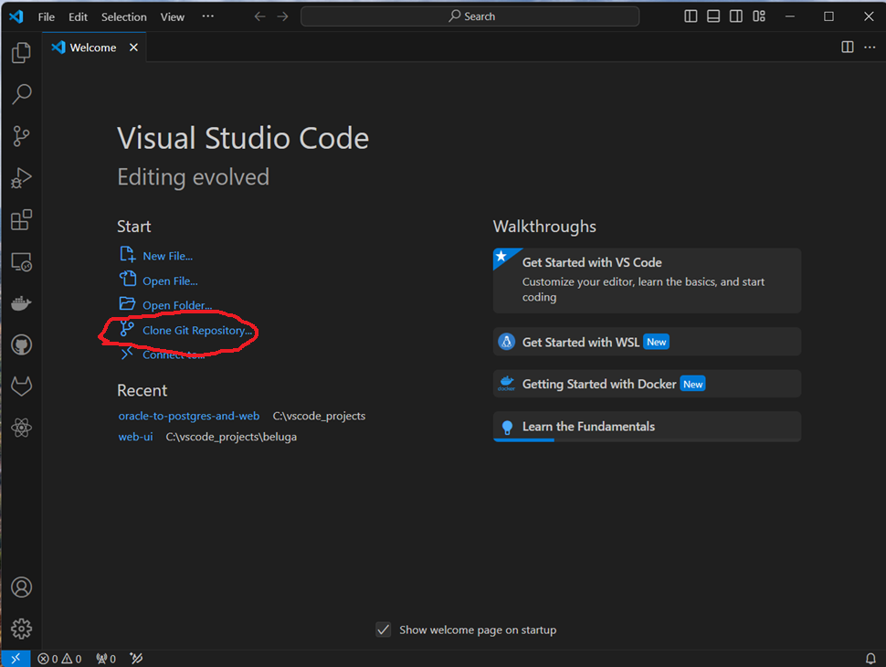
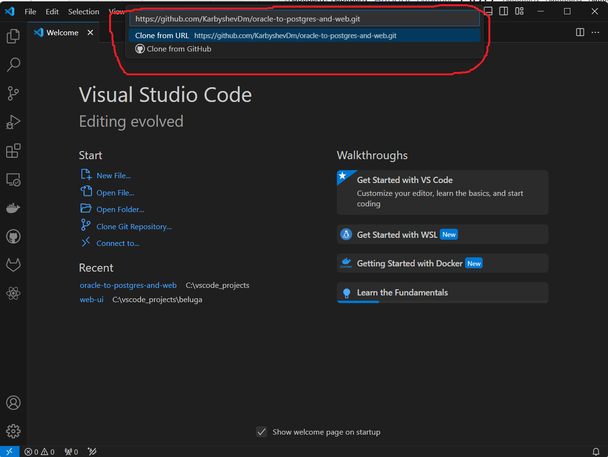
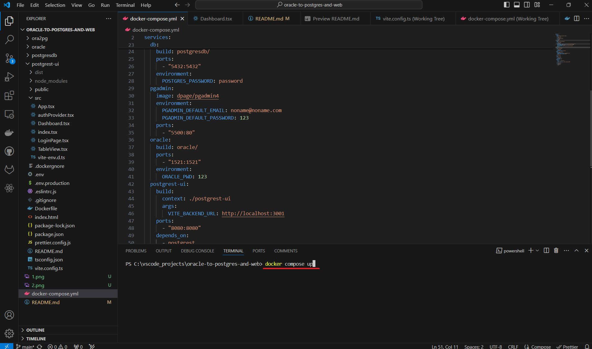
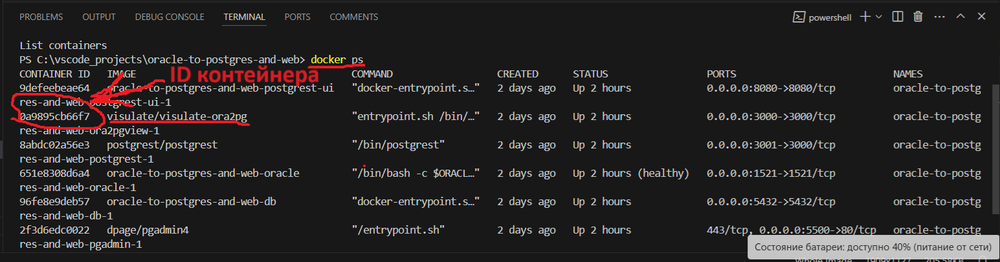
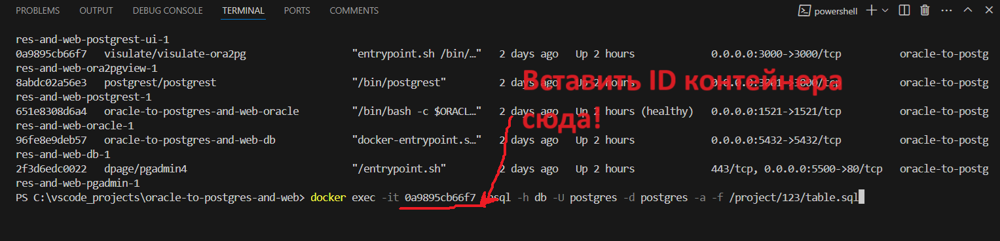
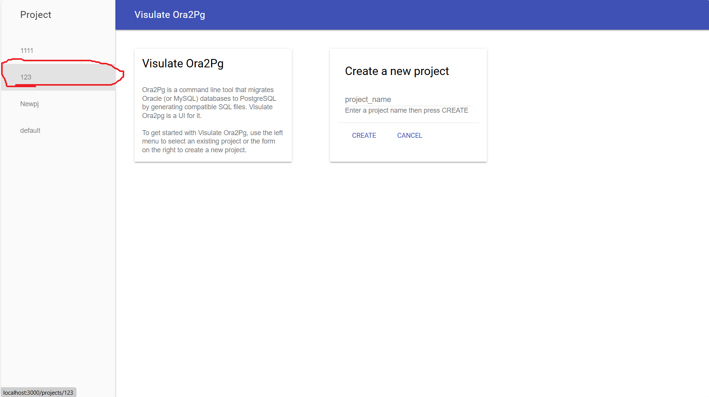
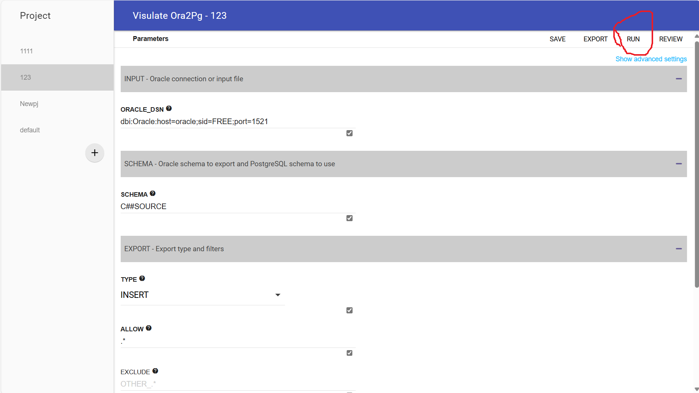
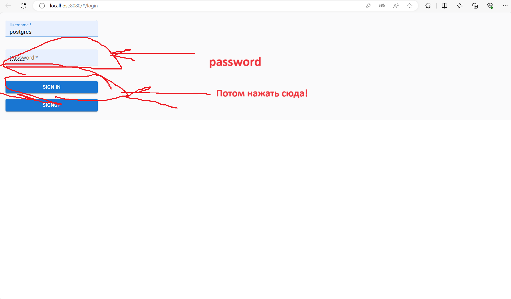
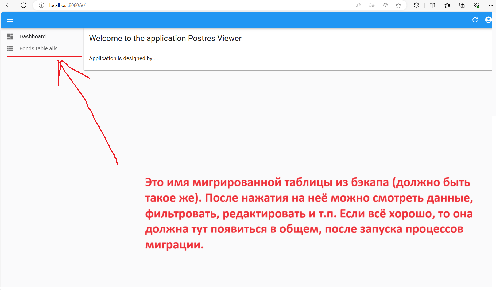
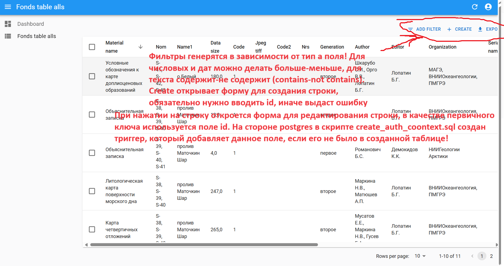

1. Перед запуском следует установить git (https://git-scm.com/download/win), docker desktop (https://www.docker.com/products/docker-desktop/), любую ide, желательно vscode (https://code.visualstudio.com/). После установки перезапустить компьютер.
2. В vscode создать новый проект, затем загрузить репозиторий с помощью команды "git clone https://github.com/KarbyshevDm/oracle-to-postgres-and-web.git" или средствами vscode сделать clone из данной ссылки на репозиторий.

3. Выполнить команду docker compose up в каталоге с файлом docker-compose.yml.

4. После того, как контейнеры будут србраны и запущены выполнить миграцию данных: сначала создать структуру таблицы, затем сделать insert данных с помощью средства ora2pg visulate. Для копирования следует запустить сгенерированный скрипт table.sql из каталога /project/<имя_проекта> из контейнера ora2pgview, для этого нужно узнать его имя, можно посмотреть в в приложении docker desktop или с помощью команды docker ps. Затем выполнить команду в командной строке хостовой машины (можно и внутри vscode в терминале) docker exec -it <имя_контейнера>  psql -h db -U postgres -d postgres -a -f /project/<имя_проекта_в_ora2pgview>/table.sql (можно использовать проект 123, в нем уже все настроено и готово для ичпользоваиня).

Далее попросит ввести пароль для пользователя postgtes (пароль такой же как и в файле docker-compose.yml: password) и после этого создастся таблица в  postgres, куда затем можно вставлять данные. Затем открыть в браузере веб-приложение по ссылке http://localhost:3000, выбрать в меню с боку проект (123) в параметре type выбрать insert (в сохраенном конфиге выбран сразу!), затем нажать на кнопку run. 

После этого потребует ввести учетные данные для oracle и postgres (для oracle: имя: C##SOURCE, пароль: 123; postgres: имя: postgres, пароль: password).

5. После того как команда завершится успешешно, можно использовать веб-приложение, запущенное по адресу http://localhost:8080, для входа также исполтзуются данные пользователей postgres (войти можно также по учетке postgres:password).

 После в меню справа будут доступны таблицы, с которыми может работать пользователь.

